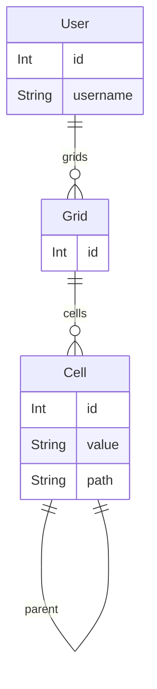

# Database Model

> [!NOTE]
> This is a work in progress.

```mermaid
erDiagram

User {
    Int id
    String username
}

Grid {
    Int id
}

Cell {
    Int id
    String value
    String path
}

User || -- }o Grid : grids
Grid || -- }o Cell : cells
Cell || -- || Cell : parent
```
